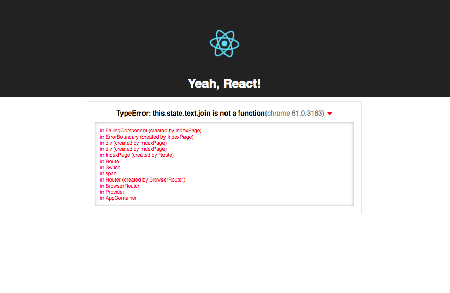

# React Did Catch
[see on npm](https://www.npmjs.com/package/react-did-catch)

A simple component for React v.16 that catches javascript errors during rendering.
Based on [React Error Boundaries.](https://reactjs.org/docs/error-boundaries.html)

#### Usage:
````javascript
import React from 'react';
import CatchError from 'react-did-catch';

class FailingComponent extends React.Component {
  state = {
    text: ['99', 'little', 'bugs', 'in', 'the', 'code'],
  };

  handleClick = () => {
    this.setState({ text: 5 });
  };

  render() {
    return (
      <div>
        <button onClick={this.handleClick}>cause error</button>
        <p>{this.state.text.join(' ')}</p>
      </div>
    );
  }
}

const SafeComponent = () => (
  <CatchError>
    <FailingComponent />
  </CatchError>
); 


````
Now if you click the button, *CatchError* will catch the error and by default render the error
and stack-trace message.

#### Custom component with `render` prop:
````javascript
const SafeComponent = () => (
  <CatchError 
    render={
      (error, info, browser) => <MyCustomComponent error={error} info={info} browser={browser} />
    }
  >
    <FailingComponent />
  </CatchError>
);
````

`browser` parameter is passed from [detect-browser.](https://www.npmjs.com/package/detect-browser)

#### `ErrorMessage` component
You can extract component responsible for printing error and stack-trace. It requires, two props
(error and info) props from [componentDidCatch](https://reactjs.org/docs/error-boundaries.html#componentdidcatch-parameters) hook.

````javascript
import CatchError, { ErrorMessage } from 'react-did-catch';
const SafeComponent = () => (
  <CatchError
    render={(error, info, browser) => {
      reportTheError(error, info, browser);
      return (
        <div>
          <p>Houston! We have problem.</p>
          <ErrorMessage error={error} info={info} />
        <div>
      );
    }}
  >
    <FailingComponent />
  </CatchError>
);
````

### Styling `ErrorMessage` component 
Currently you can override default minimalistic styling using `customStyles` prop object with keys like: 
* `container` 
* `errorMessage` 
* `componentStack` 
* `browserInfo`
* `arrow`
 
````javascript
const customStyles = {
  arrow: {
    borderColor: 'transparent transparent red',
  },
  container: {
    border: '1px solid rgba(0,0,0,.1)',
    padding: '15px',
    width: '60%',
  },
  errorMessage: {
    textAlign: 'center',
  },
  componentStack: {
    color: 'red',
    marginTop: '10px',
    fontSize: '10px',
    padding: '10px',
    boxShadow: 'inset 0px 0px 10px 0px rgba(0,0,0,0.3)',
  },
  browserInfo: {
    color: 'gray',
  },
};
const SafeComponent = () => (
  <CatchError customStyles={customStyles}>
    <FailingComponent />
  </CatchError>
); 
````

Which will produce:


You can also pass styles directly to `ErrorMessage`:

````javascript
<ErrorMessage error={error} info={info} customStyles={customStyles} />
````

